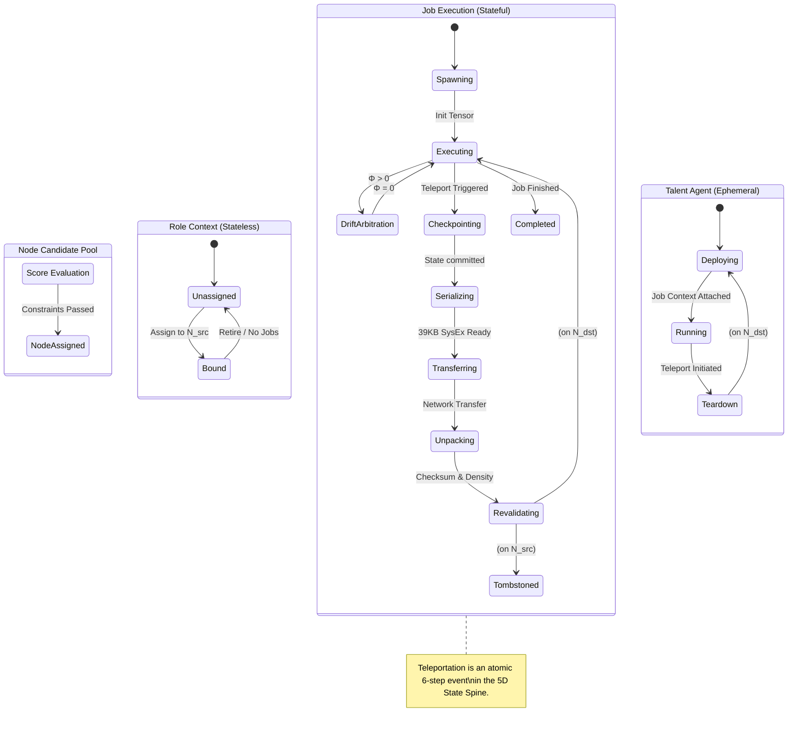

# Teleportation Scheduler and Role-Job-Talent Taxonomy

This document formally specifies the Role-Job-Talent hierarchy, the Node capability model, and the atomic state-transition contracts for deterministic teleportation across the Sovereign Mesh.

## 1. Formal Definitions

### Node (N)
A hardware endpoint with measurable attributes.
`N = { id, npu_type, throughput, latency, battery, thermal, reputation, drift_score }`

### Role (R)
A portable capability profile defining *what* a Node may do, not *which state* it holds.
- **Type:** `R_type ∈ {Temporal-Verifier, AR-Render-Relay, ...}`
- **Constraints:** Required capabilities `C_R` (min throughput, max latency, drift threshold).
- **Binding:** A Node may hold multiple Roles: `R → bind N` iff `N` satisfies `C_R`.
- **Stateless:** Roles are stateless capability envelopes.

### Job (J)
A concrete execution instance under a Role.
- `J = { id, role_id, agent_id, lpv5d_tensor, status, proofs }`
- State lives in the LPV-5D tensor + PoUW checkpoints.
- Jobs are the smallest unit of authoritative state and drift (Φ).
- A Role may own many Jobs: `R → {J_1, J_2, ...}`.

### Talent (T)
A deployable agent/model bound to a Job on a Node.
- `T = { id, model_ref, version, hyperparams, runtime_caps }`
- Instantiated per Node as a process/container.
- Reads/writes only **Job-scoped** state (LPV-5D tensor, Valkey keys).
- **Fully portable:** Can be torn down and re-instantiated on another Node as long as the Job state is migrated.

---

## 2. Teleportation Scheduler Model

### Node Score Function
For each candidate Node `N_i`, compute:
`score(N_i) = f(throughput, latency, battery, thermal, reputation, drift_score, redundancy)`

Subject to hard constraints:
- `drift_score <= drift_max`
- `thermal <= thermal_max`
- `battery >= battery_min`

Only Nodes passing constraints enter the candidate set for a given Role/Job.

### Teleportation Event (Atomic Handoff Contract)
A teleportation of a Role+Job+Talent triple is:
`T: (R, J, T, N_src) → (R, J, T, N_dst)`

The atomic handoff contract follows a strict 6-step sequence:
1. **Freeze:**
   - Lock Job `J` on `N_src` (no new tickets/inputs).
   - Run Drift Arbitration Loop → enforce Φ = 0 (see **DAL Blueprint** in [lpv5d_dal_sysex_pipeline.md](lpv5d_dal_sysex_pipeline.md)).
2. **Checkpoint:**
   - Commit latest PoUW state (`submit_proof`, `checkpoint`).
   - Extract LPV-5D tensor from Valkey.
3. **Serialize:**
   - Run SysEx Matrix Serialization → 39KB snapshot (see **SysEx Matrix Serialization Pipeline** in [lpv5d_dal_sysex_pipeline.md](lpv5d_dal_sysex_pipeline.md)).
   - Validate 7-bit, checksum, ternary density.
4. **Transfer:**
   - Stream SysEx over Cloudflare mesh to `N_dst`.
   - Store in staging (`mesh:snapshot:pending:{job_id}`).
5. **Unpack + Revalidate:**
   - `validate_and_unpack` on `N_dst` (checksum + density guard).
   - Load tensor into local Valkey; recompute Φ (must be 0).
6. **Rebind:**
   - Bind Role `R` to `N_dst` (capability check).
   - Instantiate Talent `T` with Job `J`'s state.
   - Mark `N_src` Job as tombstoned; emit audit event.

Only when all six steps succeed is `T` considered **committed**.

---

## 3. Lifecycles

### Role Lifecycle
- **Create:** define capability envelope `C_R`.
- **Assign:** bind to Nodes that satisfy `C_R`.
- **Teleport:** rebind to new Node when score degrades or failure occurs.
- **Retire:** unbind and archive when no Jobs remain.

### Job Lifecycle
- **Spawn:** created under a Role with initial LPV-5D tensor.
- **Execute:** Talents mutate tensor; PoUW proofs accumulate.
- **Drift Handling:** Drift Arbitration Loop runs whenever Φ > 0.
- **Teleport:** Job state migrates via SysEx; Role/Talent follow.
- **Complete:** Job finalized; tensor snapshot archived.

### Talent Lifecycle
- **Deploy:** instantiated on Node with Job context.
- **Run:** performs inference/logic, always writing through LPV-5D + PoUW.
- **Teleport:** torn down on `N_src`, re-instantiated on `N_dst` after Job migration.
- **Upgrade/Rollback:** versioned independently, but never changes Job history.

---

## 4. State-Transfer Mechanisms Alignment

- **Authoritative State:**
  - Lives in LPV-5D tensor + PoUW checkpoints.
  - Never in CLI or ephemeral Talent internals.
- **Transfer Path:**
  - LPV-5D → SysEx → Cloudflare Worker/Durable Object → Rust/WASM validator → Valkey on target Node.
- **Safety Invariants:**
  - **Pre-flight:** Φ = 0 before export.
  - **In-flight:** 7-bit, checksum, ternary density guard.
  - **Post-flight:** re-compute Φ, reject if Φ > 0.

---

## 5. Role-Job-Talent Teleportation State Machine

