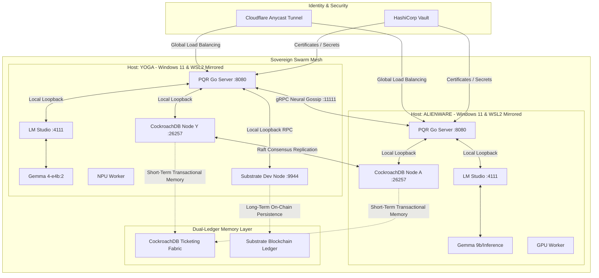
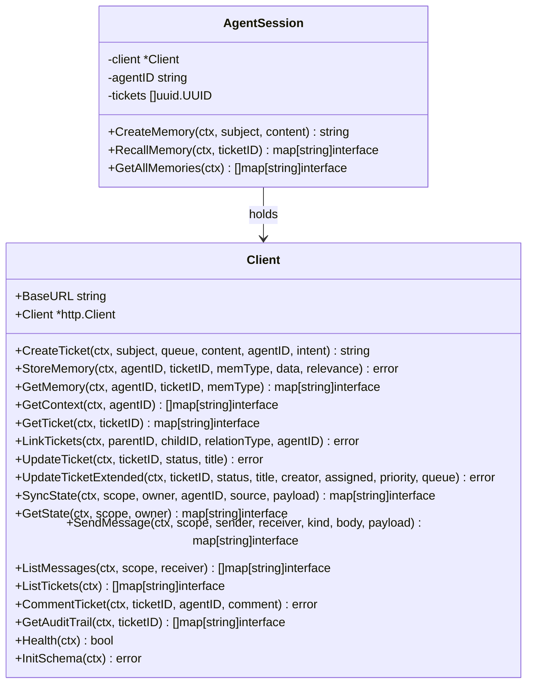
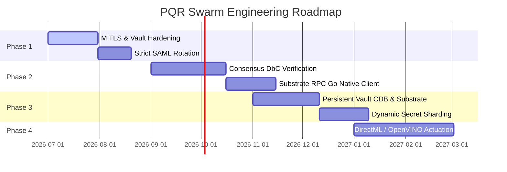

# Sovereign Swarm Architecture Governance & Roadmap

This document serves as the formal technology standard, architecture specification, governance charter, and long-term roadmap for the **PQR Swarm Ticketing System**. It defines the engineering standards, maps the runtime capabilities, audits architectural debt, and charts the execution strategy for the Sovereign Swarm.

---

## 1. Principal Swarm Architecture and System Topology

The PQR Swarm is designed as a distributed, metadata-driven, self-healing mesh. It acts as an autonomous substrate for agent orchestration, transient state synchronization, and verifiable audit records.

### 1.1 Physical Infrastructure Topology
The production fabric consists of two physical nodes:
1. **Node: YOGA** (Primary Orchestration, Local Inference, and On-Chain Anchor)
   * **Hardware**: AMD Ryzen + 6GB AMD Radeon Graphics + Integrated NPU.
   * **Role**: Primary routing endpoint, local execution monitoring, low-latency inference using `gemma-4-e4b:2` through LM Studio, and host for the local Substrate development node template.
2. **Node: ALIENWARE** (High-Throughput Inference & Redundancy)
   * **Hardware**: Intel Core i7 + 8GB NVIDIA RTX 2080 Max-Q GPU.
   * **Role**: Heavy inference backend, redundant database master, active failover target, and secondary state synchronizer.

### 1.2 Host Swarm Topology & Mirrored WSL2 Networking
To overcome the virtual network isolation boundaries common in traditional virtualization, both YOGA and ALIENWARE nodes run WSL2 under a **Mirrored Networking Mode** configuration. This is defined in the host-level [.wslconfig](file:///C:/Users/theal/.wslconfig) configuration:
* **Mirrored Interface Mapping**: The setting `networkingMode=mirrored` instructs the hypervisor to mirror the Windows host's network interfaces directly into the WSL2 VM. As a result, the Linux environment and Windows share the same IP addresses, MAC addresses, and routing tables.
* **Direct Socket Binding**: Services running inside WSL2 (such as the Go PQR Server binding to port `8080` or CockroachDB on port `26257`) are reachable on the Windows host on `localhost`. Conversely, Windows services (like LM Studio on port `4111` or the Substrate node template on port `9944`) are exposed directly to the WSL2 Go server on `localhost` without network address translation (NAT).
* **Localhost Loopback Integration**: Explicitly setting `hostAddressLoopback=true` ensures that local loopback calls resolve reliably across the Windows/WSL2 boundary.
* **Zero-Proxy Execution**: Mirrored mode eliminates the necessity for manual port proxies or routing scripts, such as the legacy [bridge_wsl_windows.ps1](file:///C:/Users/theal/SWEND-MESH/SUBSTRATE/bridge_wsl_windows.ps1) script, enabling direct connection speeds and native network performance.

### 1.3 Substrate On-Chain Memory Layer & Dual-Ledger Model
The Swarm utilizes a **Dual-Ledger Model** to balance transactional execution speed with cryptographic storage permanence:
1. **PQR CockroachDB Ticketing Fabric (High-Frequency Transactional Memory)**:
   * **Purpose**: Manages active tickets, rapid-fire comments, audit log inputs, and high-frequency agent-to-agent gossip messages.
   * **Implementation**: Handled by the Go services calling the database layer in [cockroach.go](file:///D:/pqr.info/internal/infrastructure/db/cockroach.go).
   * **Characteristics**: Replicated via Raft consensus across YOGA and ALIENWARE CockroachDB instances, providing low-latency ACID transactions and structural indexing, but remains vulnerable to total cluster/filesystem failures.
2. **Local Substrate Timeslips Pallet (Immutable On-Chain Memory)**:
   * **Purpose**: Serves as the long-term, tamper-proof audit log and cognitive memory store that survives database corruption or WSL2 instance rebuilds.
   * **Implementation**: Managed by the python [agent_memory.py](file:///C:/Users/theal/agent_memory.py) layer communicating with the local Substrate node running at `ws://127.0.0.1:9944` using the custom `Timeslips` pallet.
   * **Operational Flow**: When agents transition tickets to terminal states or complete significant cognitive milestones, they compile a `Timeslip` struct. This is written on-chain via the `open_timeslip` extrinsic (signed by default dev keys such as `//Alice` or BIP-27 derived keys) and verified for block inclusion.
   * **Structure**: Each on-chain timeslip contains fields for `id` (auto-incremented on-chain), `synthetic_id` (the memory UUID), `title` (raw content/memory description), `status` (Open/Closed/Invalidated/Rollback), `checkpoint_id`, `billable`, `rate`, `start_time`, `end_time`, `cost`, `rollback_note`, `created_by`, and `assigned_to`.

### 1.4 Network Fabric & Consensus
* **Backbone**: Gigabit Ethernet LAN for node-to-node replication; Cloudflare Tunnels (Anycast load balancing) for external ingress.
* **Communication Protocols**: 
  * **gRPC Neural Gossip**: High-speed, duplex streaming via [SwarmClient](file:///D:/pqr.info/internal/service/swarm_client.go) for remote Actuator (SWEN) operations and execution streams.
  * **REST 2.0 API**: HTTP/JSON interface for agent memory storage, state synchronization, and human administrative interfaces.
  * **Substrate RPC (WebSocket)**: WebSocket-based JSON-RPC protocol (`ws://127.0.0.1:9944`) used for submitting extrinsics and querying chain-state records from [agent_memory.py](file:///C:/Users/theal/agent_memory.py).
* **Data Layer Consensus**: 
  * CockroachDB uses range-level Raft consensus for synchronous replication across the laptop swarm.
  * Substrate utilizes the Aura (Authority Round) consensus algorithm for block production and GRANDPA for finality.

### 1.5 Identity Fabric & Security Boundaries
* **Identity Provider**: SAML 2.0 SSO integrated via [AuthService](file:///D:/pqr.info/internal/service/auth_service.go) for web dashboard access.
* **Access Control**: Cloudflare Access Service Tokens (`CF-Access-Client-Id` and `CF-Access-Client-Secret`) guard external endpoints.
* **Key Management**: Secrets, API keys, and private keys are dynamically retrieved from HashiCorp Vault.
* **On-Chain Identity**: BIP-27 key derivation in [substrate27kv/main.go](file:///D:/pqr.info/cmd/substrate27kv/main.go) expands 128-bit seeds to 256-bit to generate Ed25519 keypairs, yielding unique SS58 addresses (Prefix 42) for agent cryptographic signatures.

### 1.6 Monorepo Layout and Workspace Sidecars
The PQR project is organized as a structured monorepo (`PQR.INFO`). It separates the transactional database-driven ticketing core from local client utilities and high-performance execution modules.

* **Core Ticketing & Database Layer (Root Level)**:
  * [server.go](file:///D:/pqr.info/server.go): The REST 2.0 HTTP/JSON gateway routing client queries, healing sequences, and model chat pipelines.
  * [client.go](file:///D:/pqr.info/client.go): Go interface wrappers (`Client` and `AgentSession`) for agent memory storage and CRUD ticket actions.
  * [internal/](file:///D:/pqr.info/internal/): Core backend services and database handlers:
    * `infrastructure/db/`: Contains the CockroachDB cluster driver ([cockroach.go](file:///D:/pqr.info/internal/infrastructure/db/cockroach.go)) and file system journaling layers.
    * `service/`: Houses cognitive search algorithms, SAML auth processors, and telemetry metric scrapers.
    * `worker/`: Manages asynchronous schedulers, NPU model loaders ([npu_worker.go](file:///D:/pqr.info/internal/worker/npu_worker.go)), and OpenVINO workers.
  * [cmd/](file:///D:/pqr.info/cmd/): Entry points for the core platform executables:
    * `cmd/pqr/`: Compiles into `pqr.exe`, the primary background daemon and TUI orchestrator.
    * `cmd/bcpd/`: The Real-Time Backchannel Continuity Protocol (`AG-BCP/1.0`) daemon.
    * `cmd/substrate27kv/`: Command-line manager for BIP-27 key derivation and remote key storage.

* **Monorepo Workspace Sidecars (Subdirectories)**:
  * [cockpit/](file:///D:/pqr.info/cockpit/): Bubbletea-based terminal user interface (TUI) facilitating multi-agent execution views and console interactions.
  * [pqrcloud/](file:///D:/pqr.info/pqrcloud/): Automated Hetzner virtual machine provisioning scripts, SSH execution configurations, and deployment CLI code.
  * [web/](file:///D:/pqr.info/web/): HTML5, CSS, and JS web dashboards, including the real-time operational head-up displays (HUDs).
  * [docs/](file:///D:/pqr.info/docs/): Technical documentation, design specifications, and architecture roadmap definitions.
  * [nginx/](file:///D:/pqr.info/nginx/): Load balancer proxy settings mapping internal ports to SSL ingress endpoints.
  * [vault/](file:///D:/pqr.info/vault/): Local configurations and startup scripts for the developer HashiCorp Vault.
  * [mev/](file:///D:/pqr.info/mev/): Low-latency transaction simulation and execution engine sidecar.

### 1.7 MEV Low-Latency Execution Sidecar
The [mev/](file:///D:/pqr.info/mev/) subdirectory functions as a critical execution sidecar within the monorepo architecture. It is designed to ingest blockchain mempool feeds, simulate gas costs, detect profit opportunities, and execute atomic transactions at sub-microsecond speeds.

* **The Four-Language Pipeline**:
  1. **Go (Network Ingestion - `mev/network`)**: Handles highly concurrent I/O. Establishes WebSocket feeds to Ethereum nodes, monitors transaction propagation, implements mempool tracking, and manages the HTTP metrics server.
  2. **Rust (Detection & Simulation - `mev/core`)**: Implements safe, high-performance logic. Decodes transaction calldata, simulates price impact, manages state caches, and exposes FFI bindings to target C speedups.
  3. **C (SIMD Hot Path - `mev/fast`)**: Focuses on absolute execution speed. Compiled with target machine optimizations (`AVX2` and `SSE4.2` instructions), it contains assembly-grade Keccak-256 implementations (`memcpy`-safe absorb), RLP byte serialization, a lock-free Multi-Producer Single-Consumer (MPSC) queue using Compare-and-Swap (CAS) slot-claims, and custom arena memory pools to prevent runtime allocation delays.
  4. **Solidity (On-Chain Smart Contracts - `mev/contracts`)**: Smart contracts written for the Ethereum Virtual Machine (EVM), structured via Foundry. Implements atomic multi-hop swaps, flash loans, and liquidations.

* **Performance Characteristics**:
  * **End-to-End Latency**: Evaluates transaction streams at **~600 ns per opportunity** (sub-microsecond internal latency) from mempool ingress to execution output.
  * **Lock-Free Concurrency**: Completely eliminates mutex lock contention using CAS-only rings.
  * **Hardware-Level Speed**: Uses AVX2 SIMD lookup arrays, prefetching bytes (`_mm_prefetch`), and non-temporal writes to optimize vector and memory bus speeds.
  * **FFI Fallbacks**: Links directly into the Rust crate (`core/src/ffi/`) while retaining Rust fallbacks for environments without compiled C libraries.

* **Integration in Monorepo Design**:
  * **Self-Healing Loop**: Exposes a `mesh-adapter/` that forwards MEV connection drop warnings to the PQR self-healing endpoint (`/healer/trigger-recovery`), generating PQR tickets that trigger automated reconnection sequences.
  * **Containerized Orchestration**: Configured within the central [docker-compose.prod.yml](file:///D:/pqr.info/mev/docker-compose.prod.yml) stack, enabling unified deployment of the Substrate Dev Node, Go Time Machine, and the MEV engine.

---

## 2. Actual vs. Planned Feature Map

To align governance specifications with the codebase, this section maps actual Go and Substrate implementations against planned design specs.

### 2.1 API Route Analysis (Planned: 24 Core Routes vs. Actual: 39 Routes)
The codebase implements a comprehensive set of 39 routes grouped under `/REST/2.0` (plus 2 SAML routes), exceeding the original planned core list to accommodate testing, legacy S25 compatibility, self-healing, and domain registrar operations.

| Category | Route | HTTP Method | Handler Function | Status |
| :--- | :--- | :---: | :--- | :---: |
| **Core Ticket CRUD** | `/REST/2.0/ticket` | `POST` | `handleCreateTicket` | Active |
| | `/REST/2.0/ticket/:id` | `GET` | `handleGetTicket` | Active |
| | `/REST/2.0/ticket/:id` | `PUT` | `handleUpdateTicket` | Active |
| | `/REST/2.0/ticket/:id/comment` | `POST` | `handleCreateComment` | Active |
| | `/REST/2.0/tickets` | `GET` | `handleSearchTickets` | Active |
| **Agent Memory** | `/REST/2.0/agent/:agentID/memory/:ticketID` | `POST` | `handleStoreMemory` | Active |
| | `/REST/2.0/agent/:agentID/memory/:ticketID` | `GET` | `handleGetMemory` | Active |
| | `/REST/2.0/agent/:agentID/context` | `GET` | `handleGetAgentContext` | Active |
| **State Sync & Gossip** | `/REST/2.0/state/sync` | `POST` | `handleSyncState` | Active |
| | `/REST/2.0/state/:scope` | `GET` | `handleGetState` | Active |
| | `/REST/2.0/state/message` | `POST` | `handleSendMessage` | Active |
| | `/REST/2.0/state/:scope/messages/:receiver` | `GET` | `handleListMessages` | Active |
| **Forensics & Links** | `/REST/2.0/ticket/:id/audit` | `GET` | `handleGetAuditTrail` | Active |
| | `/REST/2.0/ticket/:id/links` | `GET` | `handleGetLinks` | Active |
| | `/REST/2.0/ticket/:id/link/:childID` | `POST` | `handleLinkTickets` | Active |
| **Self-Healing** | `/REST/2.0/healing/ticket` | `POST` | `handleCreateHealingTicket` | Active |
| | `/REST/2.0/healing/iterate/:id` | `POST` | `handleProcessHealingIteration` | Active |
| | `/REST/2.0/healing/failure` | `POST` | `handleRecordHealingFailure` | Active |
| | `/REST/2.0/healing/resolve` | `POST` | `handleResolveHealingTicket` | Active |
| **AI Inference** | `/REST/2.0/chat/gemma` | `POST` | `handleGemmaChat` | Active |
| | `/REST/2.0/chat/lmstudio` | `POST` | `handleLMStudioChat` | Active |
| | `/REST/2.0/chat/swarm` | `POST` | `handleSwarmChat` | Active |
| | `/REST/2.0/health/gemma` | `GET` | `handleGemmaHealth` | Active |
| | `/REST/2.0/health/lmstudio` | `GET` | `handleLMStudioHealth` | Active |
| **Agent Comm** | `/REST/2.0/agent/:agentID/message` | `POST` | `handleAgentMessage` | Active |
| | `/REST/2.0/agent/:agentID/conversation` | `GET` | `handleAgentConversation` | Active |
| **Legacy S25** | `/REST/2.0/status` | `GET` | `handleStatus` | Deprecated |
| | `/REST/2.0/bridge` | `GET` | `handleBridge` | Deprecated |
| | `/REST/2.0/files` | `GET` | `handleListFiles` | Deprecated |
| | `/REST/2.0/wiki` | `GET` | `handleWiki` | Deprecated |
| **Emergency Bridge** | `/REST/2.0/emergency/bridge` | `POST` | `handleEmergencyBridge` | Active |
| **Registrar** | `/REST/2.0/registrar/search` | `GET` | `handleRegistrarSearch` | Active |
| | `/REST/2.0/registrar/register` | `POST` | `handleRegistrarRegister` | Active |
| **Emergency SOS** | `/REST/2.0/sos/state` | `GET` | `handleGetSOSState` | Active |
| | `/REST/2.0/sos/timeline` | `GET` | `handleGetSOSTimeline` | Active |
| **Misc & Core** | `/REST/2.0/metrics/tokens` | `GET` | `handleGetMetrics` | Active |
| | `/REST/2.0/init` | `POST` | `handleInitSchema` | Active |
| | `/REST/2.0/docs/:name` | `GET` | `handleGetDoc` | Active |
| **SAML** | `/saml/metadata` | `GET` | `Auth.HandleMetadata` | Active |
| | `/saml/sso` | `POST`/`GET` | `Auth.HandleSSO` | Active |

### 2.2 Client Library Methods (Planned: 12 Core Capabilities vs. Actual: 17 Client + 3 Session Methods)
The Client library implemented in [client.go](file:///D:/pqr.info/client.go) maps the REST 2.0 endpoints to Go structs, exposing two user-facing interfaces: `Client` and `AgentSession`.

#### Mapping to 12 Core Planned Client Capabilities:
1. **CreateTicket** &rarr; Encompassed by `Client.CreateTicket` and `AgentSession.CreateMemory`.
2. **GetTicket** &rarr; Encompassed by `Client.GetTicket`.
3. **UpdateTicket** &rarr; Encompassed by `Client.UpdateTicket` and `Client.UpdateTicketExtended`.
4. **LinkTickets** &rarr; Encompassed by `Client.LinkTickets`.
5. **CommentTicket** &rarr; Encompassed by `Client.CommentTicket`.
6. **GetAuditTrail** &rarr; Encompassed by `Client.GetAuditTrail`.
7. **StoreMemory** &rarr; Encompassed by `Client.StoreMemory`.
8. **GetMemory** &rarr; Encompassed by `Client.GetMemory` and `AgentSession.RecallMemory`.
9. **GetContext** &rarr; Encompassed by `Client.GetContext` and `AgentSession.GetAllMemories`.
10. **SyncState** &rarr; Encompassed by `Client.SyncState`.
11. **GetState** &rarr; Encompassed by `Client.GetState`.
12. **SendMessage** &rarr; Encompassed by `Client.SendMessage` and `Client.ListMessages`.

### 2.3 Substrate Module Feature Map (Planned vs. Actual)

The Substrate long-term memory module features are mapped below:

| Feature / Module | Planned Specification | Actual Implementation Status |
| :--- | :--- | :--- |
| **BIP-27 Key Derivation** | Derive SS58 address from seed phrase, sign Substrate extrinsics locally in Go. | Fully implemented in [substrate27kv/main.go](file:///D:/pqr.info/cmd/substrate27kv/main.go). Successfully derives 128/256-bit seeds and SS58 addresses. Extrinsic storage commands (`store`, `revoke`) currently delegate execution over SSH to a python script on a remote server (`204.168.138.60`) rather than calling a local node. |
| **Timeslips Pallet** | Implement ticketing storage pallet (`ticketing`) on a Substrate dev node. | Implemented as the `Timeslips` pallet (`pallet-timeslips`). Struct schema supports full temporal, checkpointing, and billing parameters. Compiled successfully inside the Substrate node template environment. |
| **Agent Memory Bridge** | Python integration script (`agent_memory.py`) connecting local memory to Substrate. | Fully implemented in [agent_memory.py](file:///C:/Users/theal/agent_memory.py). Connects via WebSockets to `ws://127.0.0.1:9944`, composes extrinsics for the `Timeslips` pallet (`open_timeslip`), signs them with `//Alice`, and queries chain-state (`recall_memory`). |
| **Timeslip Watcher** | Background daemon executing tasks and recording execution results on-chain. | Implemented as a python agent bridge daemon. It polls for open Timeslips assigned to `antigravity` or `gemma`, executes LLM calls, and posts response results back on-chain. |
| **Wallet Integration & UI** | Terminal-based block explorer and basic memory visualization tools. | Replaced by Vite-based glassmorphic dashboard incorporating `@polkadot/extension-dapp` and `@polkadot/api` to sign extrinsics and visualize the chronological timeline. |

---

## 3. Deprecation Audit

As part of architectural governance, we identify systems that have been refactored, split, stubbed out, or are slated for removal to support cross-OS execution and multi-node topology.

### 3.1 OS-Specific Monolithic Refactoring
The original monolithic monitoring implementation has been split out using Go build tags (`//go:build`) to enable cross-platform operation without dependency collision.
* **Refactored Module**: The disk capacity monitoring loop in the original `monitoring_service.go` has been isolated:
  * [monitoring_disk_unix.go](file:///D:/pqr.info/internal/service/monitoring_disk_unix.go): Uses `golang.org/x/sys/unix` to query root partitions (`/`) and initiates autonomous disk cleanups via bash tools (`go clean -cache`, `rm -rf /tmp/*`).
  * [monitoring_disk_windows.go](file:///D:/pqr.info/internal/service/monitoring_disk_windows.go): Uses `golang.org/x/sys/windows` to invoke `windows.GetDiskFreeSpaceEx` targeting the system drive (`C:\`) and initiates cleanup using PowerShell cmdlets (`Get-ChildItem -Path $env:TEMP -Recurse | Remove-Item -Force`).

### 3.2 Incomplete Hardware Workers & Mocks
Several background services contain stubs or hardware mocks designed to compile but lacking native actuation logic:
1. **GPU Telemetry Mocking**: In [hardware_metrics.go](file:///D:/pqr.info/internal/service/hardware_metrics.go), the functions `mockGPU0Percent()`, `mockGPU1Percent()`, and `mockGPU2Percent()` use trigonometric sin/cos functions to simulate active hardware workloads. Native bindings to `nvidia-smi` or Windows Performance Counters do not exist.
2. **NPU Core Workers**: [npu_worker.go](file:///D:/pqr.info/internal/worker/npu_worker.go) is a logical stub. The `LoadModel()` method contains a `TODO` for `onnxruntime-directml` integration and `Infer()` acts as a simple pass-through.
3. **OpenVINO Inference Backend**: [openvino_worker.go](file:///D:/pqr.info/internal/worker/openvino_worker.go) is a logical stub. The structural pointer to `ov.Core` has been commented out, and methods are stubs waiting for active `go-openvino` binding completion.
4. **Cockpit Adapter Stubs**: The UI connector in [cockpit/internal/adapter/swen.go](file:///D:/pqr.info/cockpit/internal/adapter/swen.go) defines stub methods `FetchSwarmStream`, `FetchTimeline`, `SendAgentMessage`, and `ExecuteCommand` returning static mock strings instead of making REST 2.0 calls.

### 3.3 Deprecated API Endpoints
The following legacy S25 endpoints are marked as deprecated and are preserved only for backward compatibility with ancestral Termux scripts:
* `GET /status`: Replaced by `/REST/2.0/health`.
* `GET /bridge`: Replaced by the secure `/REST/2.0/emergency/bridge`.
* `GET /files`: Replaced by Git integration and the `/REST/2.0/docs/:name` endpoint.
* `GET /wiki`: Replaced by modular dashboard UI assets `/wiki`.

### 3.4 Substrate & Networking Module Deprecations
The integration of the on-chain memory layer and WSL2 mirrored mode has resulted in the formal deprecation of the following modules:
1. **Legacy Ticketing Pallet (`ticketing`)**: Deprecated in favor of the unified `Timeslips` pallet (`pallet-timeslips`) inside the Substrate node template runtime to align the blockchain data model with the temporal `jetweb-time-machine` specification.
2. **WSL Port Proxying (`bridge_wsl_windows.ps1`)**: The legacy PowerShell script [bridge_wsl_windows.ps1](file:///C:/Users/theal/SWEND-MESH/SUBSTRATE/bridge_wsl_windows.ps1) (which proxy-mapped ports `1111` and `11111` from the Windows host using `netsh interface portproxy` for WSL NAT compatibility) is officially deprecated. The workspace now runs under WSL2 native mirrored mode, which shares localhost namespaces automatically.
3. **Remote SSH Key-Value Helper**: The remote helper execution protocol (which invoked `substrate_helper.py` over SSH to `204.168.138.60` within [substrate27kv/main.go](file:///D:/pqr.info/cmd/substrate27kv/main.go)) is marked for deprecation in favor of local WebSocket RPC client connections via the python `substrateinterface` library directly to `ws://127.0.0.1:9944`.
4. **Data Migrator Mocking**: Speculative mock unseal keys and mock extrinsic fallbacks inside memory recovery and import scripts are deprecated. Migrator scripts are now required to fail-fast and abort execution if they cannot establish a live, verified handshake with the target Substrate RPC endpoint.

---

## 4. Long-Term Development Roadmap

To guide the evolution of the PQR Swarm toward full enterprise compliance and resilient autonomous operation, the following engineering phases are defined.

### Phase 1: Security & Identity Hardening
* **Goal**: Implement zero-trust network boundaries across all distributed nodes.
* **Milestones**:
  1. **gRPC mTLS Transition**: Deprecate `insecure.NewCredentials()` inside [swarm_client.go](file:///D:/pqr.info/internal/service/swarm_client.go#L46) and replace with mutually authenticated TLS (mTLS) using client certificates distributed by HashiCorp Vault.
  2. **Automated SAML Certificate Rotation**: Wire the certificate expiration check in [monitoring_service.go](file:///D:/pqr.info/internal/service/monitoring_service.go#L66-L77) to trigger an autonomous REST callback that re-generates and registers identity metadata inside the Vault token namespace.

### Phase 2: Consensus Scaling & On-Chain Verification
* **Goal**: Transition from speculative local execution to blockchain consensus.
* **Milestones**:
  1. **Runtime RustScript DbC Enforcement**: Translate the Design-by-Contract assertions (pre-conditions, body execution, post-conditions) defined in [SOVEREIGN_SCRIPT.md](file:///D:/pqr.info/docs/SOVEREIGN_SCRIPT.md#L9-L20) into active Go `reflect` validation interceptors inside the ticket creation and link path.
  2. **Native Go Substrate Client**: Replace the SSH-to-Python delegate in [substrate27kv/main.go](file:///D:/pqr.info/cmd/substrate27kv/main.go) with a native Go RPC implementation (e.g. using `gosubstraterpc`) to talk directly to `ws://127.0.0.1:9944`, enabling Go services to submit `Timeslips` extrinsics natively.
  3. **Swarm Register Gossip Layer**: Move transient registers (`%q`, `%r`) out of local process memory and distribute them mesh-wide via high-frequency UDP gossip to enable zero-lag state synchronization without database writes.

### Phase 3: Persistent Vault Storage & Secret Sharding
* **Goal**: Eliminate single-point-of-failure vulnerabilities in credential management.
* **Milestones**:
  1. **CockroachDB Vault Backend**: Transition HashiCorp Vault from a file-based or dev-mode backend to a replicated CockroachDB storage adapter, ensuring secret availability across Alienware and Yoga nodes.
  2. **Substrate Unseal Registry**: Implement a multi-signature unseal protocol where HashiCorp Vault unseal keys are encrypted and stored across the Substrate ledger, requiring validation from both physical host nodes (YOGA and ALIENWARE) to execute a node startup.
  3. **Sharded Secret Shares**: Implement Shamir's Secret Sharing to split the Master Unseal Key across three nodes in the swarm, preventing unauthorized node startup or key compromise.

### Phase 4: Native Hardware Acceleration
* **Goal**: Fully actuate local NPU and Intel GPU hardware to eliminate mock loops.
* **Milestones**:
  1. **DirectML ONNX Runtime Integration**: Complete the NPU implementation in [npu_worker.go](file:///D:/pqr.info/internal/worker/npu_worker.go) by implementing the ONNX Runtime Go bindings with DirectML acceleration.
  2. **OpenVINO Native Library Binding**: Load native OpenVINO shared libraries (`.dll` on Windows, `.so` on Unix) to enable local high-performance transformer inference on Intel Xe graphics.
  3. **Cockpit UI Actuation**: Replace the stubs in [cockpit/internal/adapter/swen.go](file:///D:/pqr.info/cockpit/internal/adapter/swen.go) with genuine REST calls referencing the updated client library.
