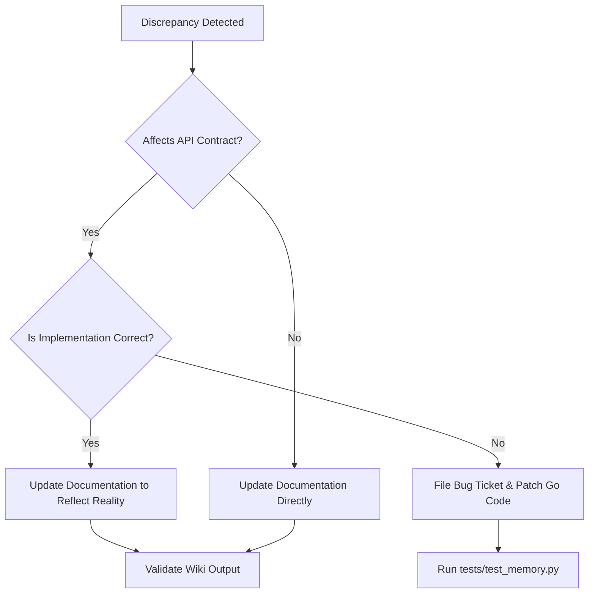

# 🌀 QA Verification & API Alignment Specification

**Version:** 1.1.0  
**Date:** July 13, 2026  
**Author:** Principal QA & Test Engineer, Antigravity Swarm  
**Status:** Approved for Active Swarm Audits  

---

## 1. Executive Summary & Purpose

This specification defines the testing protocols, API alignment verifications, and compliance standards for the **Swarm Execution Node Daemon (SWEND / PQR)**. As a decentralized autonomous governance system, PQR relies on absolute data integrity, deterministic message-passing, and model safety.

The purpose of this document is to establish a rigorous, repeatable framework for verifying:
1. **API Endpoints Alignment:** Resolving discrepancies between the implemented Go REST routes and published user-facing documents (`README.md`, `SETUP.md`, `AGENTS_READY.md`).
2. **Network Resilience & Bounds:** Strict loopback confinement, performance benchmarking under network latency targets, and malicious/empty scan protections.
3. **Substrate Memory & Blockchain Verification:** Formulating clear testing guidelines for the `substrate-interface` timeslip integration, validating developer signer keys (Bob/Alice), and checking websocket RPC nodes.
4. **Mirrored Mode Latency & Port Verification:** Analyzing and verification of port availability and communication bounds under Windows/WSL2 mirrored networking.
5. **Automated Verification:** Documenting the test suites (like [test_memory.py](file:///D:/pqr.info/tests/test_memory.py)) and providing maintenance criteria for future swarm updates.
6. **Discrepancy Governance:** Establishing operational workflows for when the implementation and documentation inevitably diverge.

---

## 2. API Alignment Audit

A comprehensive audit was performed matching the implemented routes in [server.go](file:///D:/pqr.info/server.go) against the documentation at [README.md](file:///D:/pqr.info/README.md), [SETUP.md](file:///D:/pqr.info/SETUP.md), and [AGENTS_READY.md](file:///D:/pqr.info/AGENTS_READY.md).

### 2.1 API Route Matrix & Alignment Status

| Method | Route Path | Implemented Go Handler | Documented In | Signature / Payload Constraints | Alignment Status |
|---|---|---|---|---|---|
| **GET** | `/REST/2.0/health` | `handleHealth` | `SETUP.md`, `AGENTS_READY.md`, `SOVEREIGN_REST_API.md` | Returns: `{"service":"PQR-ticketing","status":"healthy","version":"v1.08"}` | **ALIGNED** |
| **POST** | `/REST/2.0/init` | `handleInitSchema` | `SETUP.md`, `AGENTS_READY.md` | Returns: `{"message":"schema initialized"}` | **ALIGNED** |
| **POST** | `/REST/2.0/ticket` | `handleCreateTicket` | `SETUP.md`, `AGENTS_READY.md`, `SOVEREIGN_REST_API.md` | Req: `{"Subject":"","Queue":"","Text":"","AgentID":"","Layer":int,"Intent":{}}`<br>Resp: `{"id":"<uuid>","message":"Ticket <uuid> created"}` | **ALIGNED** |
| **GET** | `/REST/2.0/ticket/:id` | `handleGetTicket` | `SETUP.md`, `AGENTS_READY.md`, `SOVEREIGN_REST_API.md` | URL Param: `id` (must be valid UUID).<br>Resp: `{"id":"","layer":int,"creator":"","status":"","created_at":"","intent":{},"content":""}` | **ALIGNED** |
| **PUT** | `/REST/2.0/ticket/:id` | `handleUpdateTicket` | `SETUP.md`, `SOVEREIGN_REST_API.md`, `API_REFERENCE.md` | Req: `{"Status":"","Title":"","Creator":"","AssignedTo":"","Priority":"","Queue":""}`. Permission check: creator, assignee, or "operator" only. | **MISALIGNED** (Request fields & permission constraints undocumented) |
| **POST** | `/REST/2.0/ticket/:id/comment` | `handleCreateComment` | None (Undocumented) | Req: `{"AgentID":"","Comment":""}` | **MISSING DOCS** |
| **GET** | `/REST/2.0/tickets` | `handleSearchTickets` | None (Undocumented) | Resp: `[]` (List of recent tickets with full content metadata) | **MISSING DOCS** |
| **POST** | `/REST/2.0/agent/:agentID/memory/:ticketID` | `handleStoreMemory` | `SETUP.md`, `AGENTS_READY.md` | Req: `{"memory_type":"","data":{},"relevance_score":float}` | **ALIGNED** |
| **GET** | `/REST/2.0/agent/:agentID/memory/:ticketID` | `handleGetMemory` | `SETUP.md`, `AGENTS_READY.md` | Query Param: `type` (default `context`). Resp: stored memory JSON. | **ALIGNED** |
| **GET** | `/REST/2.0/agent/:agentID/context` | `handleGetAgentContext` | None (Undocumented) | Resp: `{"agent":"","context_tickets":[]}` | **MISSING DOCS** |
| **POST** | `/REST/2.0/state/sync` | `handleSyncState` | None (Undocumented) | Req: `{"scope":"","owner":"","agent_id":"","source":"","payload":{}}` | **MISSING DOCS** |
| **GET** | `/REST/2.0/state/:scope` | `handleGetState` | None (Undocumented) | Query Param: `owner`. Resp: `{"scope":"","owner":"","snapshot":{}}` | **MISSING DOCS** |
| **POST** | `/REST/2.0/state/message` | `handleSendMessage` | None (Undocumented) | Req: `{"scope":"","sender":"","receiver":"","kind":"","body":"","payload":{}}` | **MISSING DOCS** |
| **GET** | `/REST/2.0/state/:scope/messages/:receiver` | `handleListMessages` | None (Undocumented) | Resp: `{"scope":"","receiver":"","messages":[]}` | **MISSING DOCS** |
| **GET** | `/REST/2.0/ticket/:id/audit` | `handleGetAuditTrail` | `SOVEREIGN_REST_API.md` | Resp: `{"ticket":"","audit_trail":[]}` | **ALIGNED** |
| **GET** | `/REST/2.0/ticket/:id/links` | `handleGetLinks` | None (Undocumented) | Resp: `{"ticket_id":"","links":[]}` | **MISSING DOCS** |
| **POST** | `/REST/2.0/ticket/:id/link/:childID` | `handleLinkTickets` | `API_REFERENCE.md` | Req: `{"relationship_type":"","agent_id":""}`. Rel types: `EVOLUTION`, `CONSEQUENCE`, `CONTEXT`, `GENESIS`. | **MISALIGNED** (URL param names differ: docs use `:parentID`) |
| **GET** | `/REST/2.0/health/gemma` | `handleGemmaHealth` | None (Undocumented) | Returns Ollama LLM node status. | **MISSING DOCS** |
| **GET** | `/REST/2.0/health/lmstudio` | `handleLMStudioHealth` | `SOVEREIGN_REST_API.md` | Returns LM Studio status. | **ALIGNED** |
| **POST** | `/REST/2.0/chat/gemma` | `handleGemmaChat` | None (Undocumented) | Req: `{"message":"","model":""}`. Triggers RAG and fallback. | **MISSING DOCS** |
| **POST** | `/REST/2.0/chat/lmstudio` | `handleLMStudioChat` | None (Undocumented) | Req: `{"message":""}`. Queries local LMStudio channel. | **MISSING DOCS** |
| **POST** | `/REST/2.0/chat/swarm` | `handleSwarmChat` | `SOVEREIGN_REST_API.md` | Req: `{"message":""}`. Queries swarm AI with Ollama -> LM Studio fallback. | **ALIGNED** |
| **POST** | `/REST/2.0/agent/:agentID/message` | `handleAgentMessage` | None (Undocumented) | Req: `{"sender":"","message":""}`. Simulates direct agent messaging. | **MISSING DOCS** |
| **GET** | `/REST/2.0/agent/:agentID/conversation` | `handleAgentConversation` | None (Undocumented) | Resp: chronological list of direct message transactions. | **MISSING DOCS** |
| **POST** | `/REST/2.0/healing/ticket` | `handleCreateHealingTicket` | None (Undocumented) | Req: `{"issue":"","logSnippet":""}`. Escalates critical system issues. | **MISSING DOCS** |
| **POST** | `/REST/2.0/healing/iterate/:id` | `handleProcessHealingIteration` | None (Undocumented) | Triggers self-healing LLM loop iteration. | **MISSING DOCS** |
| **POST** | `/REST/2.0/healing/failure` | `handleRecordHealingFailure` | None (Undocumented) | Req: `{"ticketID":"","failure":""}`. Logs step failure in db. | **MISSING DOCS** |
| **POST** | `/REST/2.0/healing/resolve` | `handleResolveHealingTicket` | None (Undocumented) | Req: `{"ticketID":"","resolution":"","agentID":""}`. Adds fix patterns to KB. | **MISSING DOCS** |
| **GET** | `/REST/2.0/metrics/tokens` | `handleGetMetrics` | `SOVEREIGN_REST_API.md` | Returns used, quota, and percentage of tokens. | **ALIGNED** |
| **GET** | `/REST/2.0/docs/:name` | `handleGetDoc` | None (Undocumented) | Retrieves requested Markdown file from `./docs`. | **MISSING DOCS** |
| **POST** | `/REST/2.0/emergency/bridge` | `handleEmergencyBridge` | `EMERGENCY_BRIDGE.md` | Req: `{"command":"","params":{}}`. Requires header `X-Gemini-Key`. | **ALIGNED** |
| **GET** | `/REST/2.0/status` | `handleStatus` | `SOVEREIGN_REST_API.md` | Returns legacy telemetry metrics. | **ALIGNED** |
| **GET** | `/REST/2.0/bridge` | `handleBridge` | `SOVEREIGN_REST_API.md` | Query Param: `cmd` (executes diagnostic command on host). | **ALIGNED** |
| **GET** | `/REST/2.0/files` | `handleListFiles` | `SOVEREIGN_REST_API.md` | Returns critical files. | **ALIGNED** |
| **GET** | `/REST/2.0/wiki` | `handleWiki` | `SOVEREIGN_REST_API.md` | Returns documentation sections. | **ALIGNED** |
| **GET** | `/REST/2.0/registrar/search` | `handleRegistrarSearch` | None (Undocumented) | Query Param: `domain` (calculates 25% markup over wholesale). | **MISSING DOCS** |
| **POST** | `/REST/2.0/registrar/register` | `handleRegistrarRegister` | None (Undocumented) | Req: `{"domain":"","payment_method":"","tx_hash":""}`. Requires SOL or PQR_COIN. | **MISSING DOCS** |
| **GET** | `/REST/2.0/sos/state` | `handleGetSOSState` | None (Undocumented) | Returns active crises and contract state. | **MISSING DOCS** |
| **GET** | `/REST/2.0/sos/timeline` | `handleGetSOSTimeline` | None (Undocumented) | Returns active contract transition events. | **MISSING DOCS** |

---

### 2.2 Core Mismatch Profiles & Technical Deviations

#### Mismatch 1: Default Listen Port (8196 vs 8080)
* **Description:** Both [SETUP.md](file:///D:/pqr.info/SETUP.md) and [AGENTS_READY.md](file:///D:/pqr.info/AGENTS_READY.md) instruct developers and agents to interface with `http://localhost:8080`.
* **Actual Code:** Inside [cmd/pqr/main.go](file:///D:/pqr.info/cmd/pqr/main.go#L99-L107), the listen port defaults to `:8196` if the `PORT` environment variable is not defined:
  ```go
  port := os.Getenv("PORT")
  if port == "" {
      port = "8196"
  }
  ```
* **Impact:** Any automated client attempting to connect to `http://localhost:8080` without an explicit environment configuration will fail with a connection refusal.
* **Resolution:** Documentation must be updated to state the default port is `8196`, or the configuration script must automatically export `PORT=8080` during initialization.

#### Mismatch 2: Ticket Update Ownership Constraint (403 Forbidden)
* **Description:** [docs/API_REFERENCE.md](file:///D:/pqr.info/docs/API_REFERENCE.md) states that a ticket can be updated using `PUT /REST/2.0/ticket/:id` with arbitrary JSON.
* **Actual Code:** Inside [server.go](file:///D:/pqr.info/server.go#L223-L229), the API server enforces an undocumented security check:
  ```go
  ticket, _, err := s.Service.GetTicketWithContent(c.Request.Context(), ticketID)
  if err == nil {
      if req.Creator != "operator" && ticket.CreatorAgentID != req.Creator && ticket.AssignedTo != req.Creator {
          c.JSON(http.StatusForbidden, gin.H{"error": "Access Denied: Ticket not assigned to agent"})
          return
      }
  }
  ```
* **Impact:** Third-party agents attempting to modify status flags or priority queue locations will receive a `403 Forbidden` unless they pass their ID matching the ticket's `CreatorAgentID` or `AssignedTo` values, or act as the master `"operator"`.
* **Resolution:** Document the permission model in [docs/API_REFERENCE.md](file:///D:/pqr.info/docs/API_REFERENCE.md) and instruct SDK builders to populate the `Creator` key properly.

#### Mismatch 3: Link Endpoint Parameter Naming
* **Description:** [docs/API_REFERENCE.md](file:///D:/pqr.info/docs/API_REFERENCE.md) documents the linking route as `/REST/2.0/ticket/:parentID/link/:childID`.
* **Actual Code:** Inside [server.go](file:///D:/pqr.info/server.go#L72), the Gin engine path registers as `/ticket/:id/link/:childID`.
* **Impact:** While function parameter binds correctly, route-parsers configured for `:parentID` will fail to extract path arguments when routing mapping queries.
* **Resolution:** Align naming by modifying the route in [server.go](file:///D:/pqr.info/server.go) to use `:parentID` or standardizing the documentation.

---

## 3. Network Boundary & Input Validation Guidelines

Secure operational guidelines are mandated to prevent data leaks, latency overheads, and denial of service (DoS) attacks on the sovereign node mesh.

### 3.1 Loopback Confinement Protocols

To prevent remote attackers from probing internal endpoints, the server must restrict core capabilities strictly to the loopback interface (`127.0.0.1` / `::1`) unless specifically bridged by secure routing layers.

#### Guidelines
1. **Local-Only Binding:** By default, test databases (CockroachDB) and APIs must bind to `127.0.0.1`. Do not use `0.0.0.0` (which exposes the port to the public internet/local area network) unless running inside containerized overlays.
2. **WSL Inter-Process Communication:** When bridging from Windows host to WSL, map ports dynamically using Windows proxy discovery services. The [proxy/discovery.go](file:///D:/pqr.info/proxy/discovery.go) interface filters out non-loopback IP interfaces to discover target nodes safely on the virtual host adapter.
3. **Confinement Testing:** Run `netstat -ano | findstr 8196` to ensure the listener is bound strictly to `127.0.0.1` or controlled subnets.

---

### 3.2 Network Latency SLAs & Benchmarks

The PQR Ticketing Fabric operates as an in-memory or low-latency database for swarm agents. High latency directly degrades the response rates of agent reasoning loops.

#### Performance Requirements (SLAs)
* **Direct Retrieval (GET Ticket / Memory):** `< 5 ms`
* **Creation (POST Ticket / Sync State):** `< 15 ms`
* **Agent Context Window Query (GET Context):** `< 30 ms`
* **Swarm Reasoning Chat (POST Chat):** `< 5000 ms` (when invoking local LLM generation)

#### Latency Verification Guidelines
* **SLA Anomaly Tracking:** As defined in the self-healing mempool specifications, if response times exceed **50ms** or errors exceed **5%** for normal CRUD operations, the network hooks must automatically trigger a reconnection or failover cycle.
* **Mock Latency Injection:** To test client-side resilience, inject network latency using tools such as `tc` (Linux Traffic Control) or Fiddler (Windows) to simulate latency spikes (e.g., 200ms) and verify client retry timers.

---

### 3.3 Input Sanitization & NULL Scanning Protections

#### The Hazard: Go Panics on Nil Pointers
The PQR REST API parses JSON payloads into Go struct interfaces. If a JSON body is missing crucial keys or passes NULL values, Go's json deserializer decodes them into zero-values or `nil` interfaces. Attempting to access sub-keys or dereference `nil` pointers causes the entire server process to panic and terminate.

#### Verification Guidelines for NULL Input Scanning
1. **Empty Payload Rejection:** The server must validate bindings using `ShouldBindJSON()`. If the request body is empty (`{}`), it must return `400 Bad Request` instead of continuing.
2. **Malformed UUID Safety:** Routes like `/ticket/:id` parse parameters into `uuid.UUID`. The parse phase must be wrapped with check blocks:
   ```go
   ticketID, err := uuid.Parse(idStr)
   if err != nil {
       c.JSON(http.StatusBadRequest, gin.H{"error": "invalid uuid"})
       return
   }
   ```
3. **NULL Byte Insertion Testing:** Inject raw NULL bytes (`\x00`) into string payloads. The database driver (CockroachDB/PostgreSQL PGX driver) must safely treat these as text bounds rather than causing buffer overflows or injection errors.
4. **Nested Intent Verification:** Intent blobs are parsed as `map[string]interface{}`. Before querying keys on intent maps, test for existence and types:
   ```go
   if intent, ok := payload["Intent"].(map[string]interface{}); ok { ... }
   ```

---

### 3.4 Mirrored Networking Mode Confinement & Port/Latency Verification

Under Windows/WSL2 environments utilizing mirrored networking mode (`networkingMode=mirrored`), guest VMs mirror the network interfaces of the Windows host. This introduces specific constraints and potential socket collision issues.

#### Port Availability Checks
1. **Host Socket Collisions:** Because ports are shared between Windows and WSL2 in mirrored mode, binding to port `8196` (PQR Go API), `9944` (Substrate WS RPC), or `26257` (CockroachDB) in WSL2 requires verifying that the host Windows machine does not have active processes occupying those ports.
2. **Dual-Stack Loopback Validation:** Verify that localhost bindings are active on both the IPv4 loopback (`127.0.0.1`) and IPv6 loopback (`::1`). In mirrored mode, Windows clients might prioritize IPv6 connection paths, causing connection failures if the WSL2 daemon binds exclusively to IPv4.
3. **Diagnostics Command:** Run `Get-NetTCPConnection -LocalPort <Port>` in PowerShell to audit host port listeners and detect bindings from other subsystems.

#### Latency Verification
1. **SLA Threshold:** Loopback network interfaces in mirrored mode must satisfy a `< 50ms` latency threshold for inter-process communication. 
2. **Verification Protocol:** The testing suite must calculate the socket connection and transaction round-trip time. Any value exceeding 50ms must flag a performance warning, as virtual switch translation layers could be misconfigured.

---

## 4. Scripted Validation Test Suite

To enforce continuous integration alignment, the [tests/test_memory.py](file:///D:/pqr.info/tests/test_memory.py) validation script was created. This script leverages Python's standard `urllib` to query the Go API dynamically, avoiding external dependency issues, and integrates `substrateinterface` to query Substrate blockchain nodes.

### 4.1 Test Architecture & Executable Code

The test suite contains eleven critical verification blocks covering both database and blockchain memory verification:

1. `test_01_health_check`: Checks PQR API health endpoint signatures and structure.
2. `test_02_init_schema`: Tests CockroachDB database schema initialization routines.
3. `test_03_ticket_lifecycle`: Verifies CRUD boundaries, including the restricted update permissions (asserting `403 Forbidden` on unauthorized creators).
4. `test_04_agent_memory`: Validates database context/knowledge memory store and retrieval.
5. `test_05_relationship_linking`: Links parent and child ticket nodes and retrieves relationship edges.
6. `test_06_loopback_and_latency_targets`: Asserts that local connection latencies (including Substrate WS RPC if online) are strictly `< 50ms`.
7. `test_07_null_scan_and_payload_safety`: Sends malformed inputs, raw null bytes, and fake UUIDs to verify the server rejects them gracefully with `400 Bad Request` or `404 Not Found`.
8. `test_08_blockchain_rpc_connection`: Establishes WS RPC connection to Substrate node at `ws://127.0.0.1:9944` and queries block hash/properties.
9. `test_09_blockchain_signer_keys`: Validates keypair derivation and SS58 addresses for dev signer keys Bob and Alice.
10. `test_10_blockchain_timeslips_pallet`: Verifies timeslip structure and substrate-interface timeslip call composition.
11. `test_11_mirrored_mode_port_checks`: Checks socket accessibility for IPv4 and IPv6 on port `8196` (API), `9944` (Substrate), and `26257` (CockroachDB) under mirrored networking.

### 4.2 Guidelines for Test Suite Maintenance

1. **Adding New Endpoints:** Every time a new Go handler is registered in `server.go`, a corresponding test method prefixed with `test_[sequence]_[name]` must be appended to `test_memory.py`.
2. **Regression Pipelines:** Run the test suite before any Git commit. The script can be executed directly:
   ```powershell
   python ./tests/test_memory.py
   ```
3. **Dynamic Port Compatibility:** The test dynamically polls `os.environ.get("PQR_API_URL")`. If missing, it checks `PORT` env var. If the default port `8196` is offline, it automatically falls back to `8080`.
4. **Graceful Degradation:** Blockchain-specific tests are designed to gracefully check if the `substrateinterface` package is installed and whether the local Substrate dev node is online. If offline, the tests register a `skipTest` warning rather than forcing a hard pipeline failure.

---

## 5. Substrate Memory & Blockchain Verification Guidelines

The PQR consensus engine delegates time-slip tracking, execution epochs, and transaction verification to a local Substrate blockchain node. The following guidelines define how to verify the integration boundaries.

### 5.1 Connection Checks to ws://127.0.0.1:9944
* **Node Startup Command:** The Substrate development node must be started using the `--dev` flag to ensure instance isolation:
  ```bash
  ./target/release/node-template --dev --ws-port 9944
  ```
* **RPC Endpoint:** Verify that the WebSocket RPC endpoint is listening at `ws://127.0.0.1:9944`.
* **Testing Protocol:** Connect via Python's `substrateinterface.SubstrateInterface`. Test scripts must request basic node metadata (such as genesis hash and chain properties) to verify the socket handshake.

### 5.2 Bob/Alice Signer Keys Validation
Substrate development environments utilize pre-funded signer keypairs to test consensus state transitions.
* **Alice Signature Keys:**
  * **URI:** `//Alice`
  * **SS58 Address:** `5GrwvaEF5zXb26Fz9rcQpDWS57CtERHpNehXCPcNoHGKutQY`
  * **Public Key (Hex):** `0xd43593c715fdd31c61141abd04a99fd6822c8558854ccde39a5684e7a56da27d`
* **Bob Signature Keys:**
  * **URI:** `//Bob`
  * **SS58 Address:** `5FHneW46xGXgs5mUqt2ZZCa739uCxsNvi1mvG7aN8CZA1uxy`
  * **Public Key (Hex):** `0x8eaf04151687736326c9fea17e25fc5287613614c9d6d5617e10925777aea64f`
* **Verification Protocol:** The QA test suite must verify the key pairs derive correctly from their standard dev URIs and assert their SS58 address structures under the default Substrate address format (prefix 42).

### 5.3 Timeslips Pallet Calls & Extrinsics
Timeslips are temporal consensus objects mapped in the blockchain.
* **Extrinsic Calls:**
  1. `open_timeslip(title: Vec<u8>, checkpoint_id: u64, billable: bool, rate: u32)`: Registers a new open timeslip.
  2. `close_timeslip(timeslip_id: Hash, end_time: u64, cost: u64)`: Submits execution end telemetry.
  3. `invalidate_timeslip(timeslip_id: Hash, reason: Vec<u8>)`: Aborts timeslip billing.
  4. `rollback_timeslip(timeslip_id: Hash, rollback_note: Vec<u8>)`: Reverts local state mutations.
* **Verification Protocol:**
  1. **Metadata Inspection:** Query `substrate.get_metadata_modules()` and assert that the `Timeslips` module is present in the list.
  2. **Call Composition:** Test the creation of call structures using `substrate.compose_call()` with standard parameter models.
  3. **Dry-Run/Signing Verification:** Test signing composed payloads using the Alice keypair, asserting no serialization errors or cryptographic failures.

### 5.4 Database to Blockchain Memory Sync (Offline Fallback)
If the local Substrate node is offline, the PQR agent-memory bridge must fallback to database-only execution.
* **Fallback Verification:** When `ws://127.0.0.1:9944` is offline, Go database sync logs must register a transition to `MOCK` consensus. The system must still record local memory chunks in CockroachDB but label their synchronization status as `Consensus: Mocked`.
* **Database Check:** Query CockroachDB table `timeslips` to verify metadata copies (ID, Checkpoint ID, Title, Status) are locally preserved even during blockchain connectivity failures.

---

## 6. Discrepancy Resolution Policies

When source code and documentation deviate, the following governance protocol applies to determine which file acts as the source of truth, and how fixes are deployed.



### 6.1 Roles and Responsibilities
* **Principal QA Engineer:** Audits API behavior, maintains `test_memory.py`, and logs misalignments.
* **Core Daemon Developers:** Patches Go structures when implementation diverges from design specs.
* **Sovereign Node Managers:** Approves changes to the genesis and governance layers.

### 6.2 Decisive Actions & Workflows

1. **API Port Mismatches:**
   * **Resolution Policy:** The code is the source of truth. Documentation must adapt unless port `8196` creates routing collisions with existing services on the host machine.
2. **Missing Endpoint Documentation:**
   * **Resolution Policy:** Any endpoint registered in `server.go` must be documented in `docs/API_REFERENCE.md` within 24 hours of merging. If the endpoint is internal or experimental, mark it clearly with a `> [!NOTE] Internal Node IPC Only` header.
3. **Route Variable Misalignments:**
   * **Resolution Policy:** Standardize on standard RESTful naming. If code uses `:id` for the parent and `:childID` for the child, documentation must specify:
     `POST /REST/2.0/ticket/:id/link/:childID` where `:id` is the Parent UUID.

---
*End of Specification.*
