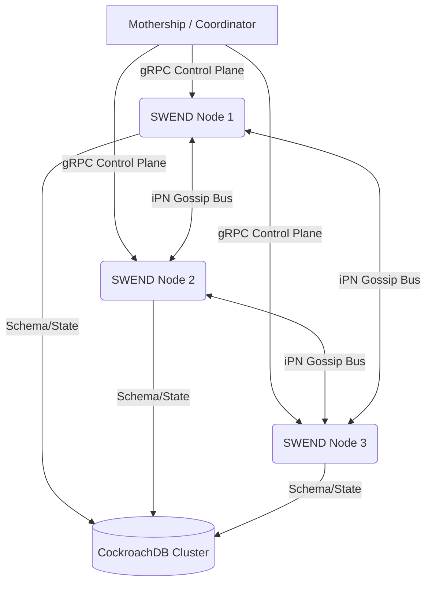

# WIKI: SWEND Architecture

Welcome to the **SWEND** (Swarm Execution Node Daemon) System Architecture Wiki.

---

## 1. System Topology Overview

SWEND is the unified execution runtime that operates on all swarm validator nodes. It coordinates task execution, synchronizes system states, and runs an intelligent sandbox environment for multi-agent processes.

---

## 2. Core Subsystems

### 2.1. Ouroboros Watchdog Sentinel
The Sentinel daemon runs inside SWEND to supervise critical execution tasks (e.g. gRPC services, HTTP APIs, and local bridges). If a flatline is detected:
1. It queries **RADIUS** to audit the failure event.
2. Log state deviation in **Jetweb Time Machine**.
3. Re-ignites the process unit instantly via the local resurrection loop.

### 2.2. Relational Memory Layer
Agent memory is organized as relational tickets in CockroachDB instead of a loose key-value store. This guarantees:
- **ACID compliance** for agent consensus decisions.
- Dynamic relationship linkage (parent-child dependencies) to prevent history drift.
- Historical replay capabilities for diagnostic rollbacks.

### 2.3. Starbirth Synchronization
Starbirth regulates the validator cluster size. If the number of active nodes drops below the **7-node validator floor**:
1. SWEND invokes the **Capicant Provisioner**.
2. Deploys dynamic external VPS nodes (GCP, Hetzner, AWS) via automated SSH/gRPC configurations.
3. Automatically redistributes computing rewards across the active consensus participants.
