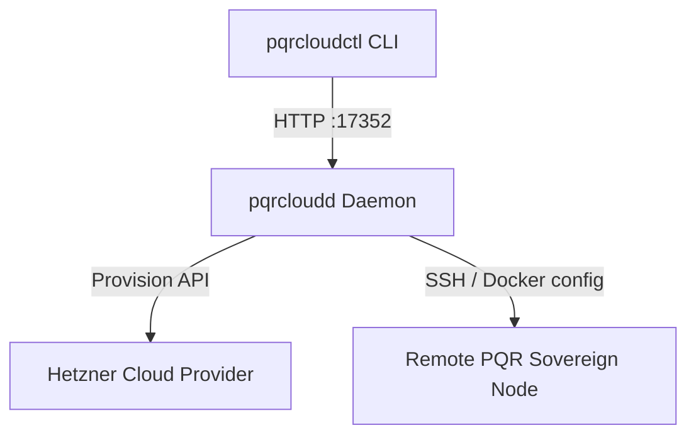

# PQRCloud Sidecar

`pqrcloud` is the cloud environment manager sidecar of the PQR sovereign node system. It includes two primary components:
1. `pqrcloudd`: A local daemon that manages target cloud VM resources (e.g. Hetzner cloud provisioning, Docker daemon hardening).
2. `pqrcloudctl`: A client CLI that interacts with the daemon to invoke VM provisioning, rollbacks, and check remote system states.

## Component Architecture



## Setup & Configuration

To use the cloud provisioner, set your Cloud provider token as an environment variable:
```bash
export HETZNER_API_KEY="your_api_key_here"
```

## Usage

### 1. Launching the Daemon (`pqrcloudd`)
Run the daemon process to listen for local commands (defaults to port `17352`):
```bash
go run ./cmd/pqrcloudd/main.go -port 17352
```

### 2. Node Control (`pqrcloudctl`)
Run the controller commands to provision new instances, manage runlevels, and query node health:

* **Create and Bootstrap Node**:
  ```bash
  go run ./cmd/pqrcloudctl/main.go -cmd create -name "nuremberg-node" -key ~/.ssh/id_rsa -archive ./compilation_bundle.tar.gz
  ```
* **Rollback Node Runlevel**:
  ```bash
  go run ./cmd/pqrcloudctl/main.go -cmd rollback -ip 12.34.56.78 -key ~/.ssh/id_rsa -runlevel 5
  ```
* **Check Node Status**:
  ```bash
  go run ./cmd/pqrcloudctl/main.go -cmd status -ip 12.34.56.78 -key ~/.ssh/id_rsa
  ```
