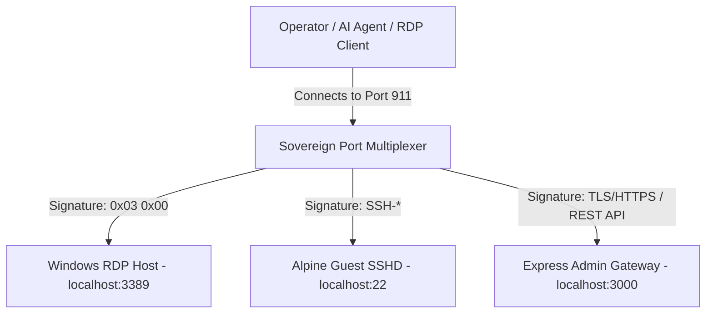

# JetWeb Time Machine OS Unified Admin Suite & Multiplexer

The **JetWeb Time Machine OS Unified Admin Suite** is a hardened, production-ready remote administration and deployment framework. Designed under the `pqr.info` standard, it narrows down administrative connections to **one single ubiquitous port (Port 911)** by leveraging a dynamic TCP connection multiplexer.

---

## Port 911 Multiplexing Architecture

Instead of opening multiple firewall endpoints (for SSH, RDP, and HTTP/HTTPS APIs), all traffic is routed through Port `911` on the Windows Host. The multiplexer inspects connection headers on-the-fly and pipes the stream locally:



### Routing Mechanisms:
1.  **RDP Protocol** (starts with `0x03 0x00` TPKT headers): Automatically routed to native Windows Remote Desktop (Terminal Service) on `localhost:3389`.
2.  **SSH Protocol** (starts with `SSH-`): Routed to the Alpine guest SSHD on `localhost:22` (forwarded via WSL).
3.  **HTTPS Admin API** (REST endpoints / JWT Handshake): Routed to the Express Administration Gateway on `localhost:3000`.

---

## Scratch Installation and Bootstrap

The suite is deployed entirely **from scratch** via `setup.ps1`. The installer downloads the official, minimal Alpine Linux OS image, provisions all packages, configures Windows RDP, and initializes Scheduled Tasks for automatic startup.

### Host Prerequisites
*   Windows 10/11 or Windows Server (with WSL2 enabled).
*   Administrator privilege execution.
*   Node.js (v18+) installed on the host.

### Syntax
Run in an elevated Windows PowerShell console:
```powershell
.\setup.ps1 -Action <Install | Uninstall | Start | Stop | Status> [-Passphrase <Secret>] [-Port <Port>] [-Username <Username>] [-SecurityMode <safe | raw>]
```

### Installation Actions:

#### 1. Bootstrap Guest OS and Services (`Install`)
```powershell
.\setup.ps1 -Action Install -Port 911 -Username "sos" -SecurityMode safe
```
This command performs the following automated steps:
1.  **Enables Host RDP**: Enables Remote Desktop Connections in the registry, starts the TermService daemon, and updates local firewall policies.
2.  **Downloads Alpine Guest**: Downloads the Alpine 3.20 Mini-Rootfs directly from the Alpine CDN to keep the initial installer package small.
3.  **WSL Registration**: Imports the image as a new WSL distribution (`JetWebTimeMachineOS`).
4.  **Guest Provisioning**: Installs core utilities (`bash`, `openssl`, `openssh`, `nodejs`, `npm`, `powershell`, `samba-client`, etc.) inside the guest.
5.  **Secure Accounts**: Creates the custom `sos` administrative user inside the guest and configures sudo access.
6.  **TLS Key Generation**: Creates a self-signed host SSL/TLS certificate for secure REST communications.
7.  **Auto-Boot Daemons**: Schedules Windows Scheduled Tasks to run the multiplexer on port `911` and the WSL guest admin services on boot.

#### 2. Service Monitoring (`Status`)
Verifies the status of Windows scheduled tasks, active processes, and check if the WSL guest container is active:
```powershell
.\setup.ps1 -Action Status
```

#### 3. Uninstallation (`Uninstall`)
Safely halts the scheduled tasks, unregisters the WSL distribution (`JetWebTimeMachineOS`), kills residual Node processes, resets the firewall entries, and deletes folders:
```powershell
.\setup.ps1 -Action Uninstall
```

---

## ⏰ JetWeb Time Machine (Rollback Engine)

The **JetWeb Time Machine** provides synchronized, dual-layer system recovery by bridging host state recovery with guest container rollbacks:
1.  **Windows Host Checkpoints**: Leverages native Windows System Restore (`Checkpoint-Computer`) to snapshot Windows system states, registry baselines, and configuration nodes.
2.  **JetWeb Time Machine OS Guest Checkpoints**: Utilizes **Restic** block-level deduplicating backup engine to snapshot administrative configurations (`/opt`, `/etc`, `/home`, `/root`) inside the guest. Subsequent snapshots only record changes since the baseline, keeping backup sizes minimal.

### Integrated Checkpoint Commands (Windows Host)
Use the included `create_checkpoint.ps1` script to snapshot both layers instantly:
```powershell
.\create_checkpoint.ps1 -Name "CheckpointName"
```

---

## 🛡️ Deletion Insulation & Self-Healing

To protect the deployed architecture from accidental or malicious administration folder deletions, the suite implements a multi-tier safety system:

### 1. NTFS File System Protection (Deny-Delete Lock)
During the installation process, the setup script configures an explicit NTFS Access Control List (ACL) rule targeting the installation directory (`C:\Program Files\JetWebTimeMachineOS`):
*   **Rule Details**: Denies the `Delete` and `DeleteSubdirectoriesAndFiles` permissions for `Everyone` (affecting all system accounts, users, and external scripting environments).
*   **Insulation**: This lock guarantees that the WSL hard drive image (`.vhdx`) and configuration launchers cannot be deleted or unlinked by accident.
*   **Uninstallation Handoff**: The custom uninstall routine (`setup.ps1 -Action Uninstall`) automatically strips this Deny-Delete rule first, allowing for clean system wipes when required.

### 2. WSL Guest Distro Self-Healing
If the `JetWebTimeMachineOS` distribution is manually unregistered, deleted from WSL, or corrupted:
*   On subsequent system boots, the gateway bootstrap wrapper (`boot_gateway.ps1`) executes a verification check.
*   If the distro is missing from the registered WSL tables, it immediately restores the environment from the baseline `PreInstall.tar` backup stored in the `checkpoints` directory, healing the distribution rootfs automatically.

## 🛡️ Security Hardening Controls

JetWeb Time Machine OS incorporates advanced security boundaries designed for production environments:

### 1. API Brute-Force Rate Limiter
The Express gateway features an in-memory authentication rate limiter protecting the `/api/auth/token` endpoint. 
*   **Behavior**: Limits requests to a maximum of **5 attempts per minute per source IP address**.
*   **Response**: Exceeding this rate immediately yields an `HTTP 429 Too Many Requests` error, insulating the system from automated dictionary or password-spraying attacks.

### 2. Host-Level Key Isolation (NTFS ACL Locks)
The Restic repository encryption key (`passwd.txt`) is protected on the host system to prevent unauthorized local read access:
*   **Isolation**: Setup strips all inherited permissions from `passwd.txt` and applies a strict Access Control List (ACL).
*   **Permissions**: Read/Write access is granted **exclusively** to the `NT AUTHORITY\SYSTEM` service account and the local `Administrators` group. Non-privileged local users cannot view or copy the password file.

### 3. Network Scoping (Firewall Rules)
Exposing administration endpoints to the WAN is protected via firewall scoping parameters:
*   **Configuration**: Setup accepts an `-AllowedIps` parameter (defaults to `"Any"`).
*   **Scoping**: Allows administrators to limit Port 911 traffic to dedicated administrative subnets or specific host addresses (e.g. `-AllowedIps "192.168.12.0/24"`).

### 4. Automatic Lock Recovery
If a backup or restore operation is terminated mid-execution, Restic's filesystem lock is automatically cleared:
*   **Recovery**: Every checkpoint and rollback action triggers a `restic unlock` routine prior to operations, preventing silent lock collisions.

### 5. WSL Interop Isolation
To prevent guest users or compromised daemons from abusing WSL Interop to execute arbitrary host commands with System privileges:
*   **Protection**: The setup script configures the guest `/etc/wsl.conf` with secure mount masks (`umask=027,fmask=117`).
*   **Isolation**: This config strips execution rights to Windows binaries (`/mnt/c/...`) for all standard Linux accounts (like `sos`), isolating the host from unauthorized guest-side executions. The root-privileged admin gateway retains its target capabilities.

---

## Secure API Integration Specification

Every REST API request directed to `https://<Host_IP>:911/` requires the following header containing the JWT token issued by `/api/auth/token`:
```http
Authorization: Bearer <JWT_Token>
```

| Method | Endpoint | Description |
| :--- | :--- | :--- |
| `POST` | `/api/auth/token` | Exchanges the admin passphrase for a secure 30m JWT session token. |
| `GET` | `/api/capabilities` | Returns self-discoverable capabilities map (e.g., security mode). |
| `GET` | `/api/diagnostics` | Returns OS system telemetry, CPU, RAM, and volume sizes. |
| `GET` | `/api/screenshot` | Captures a live PNG screenshot of the primary Windows monitor. |
| `GET` | `/api/services` | Returns a JSON catalog of native Windows services. |
| `GET` | `/api/processes` | Returns list of top 30 active processes sorted by CPU load. |
| `POST` | `/api/execute` | Executes whitelisted PowerShell commands securely. |
| `POST` | `/api/time-machine/checkpoint` | Generates a new synchronized Windows Host + WSL Guest checkpoint. |
| `POST` | `/api/time-machine/rollback` | Restores the WSL Guest and provides host restore details. |

---

## 🧪 Deployment Testing & Security Audits

An automated testing suite (`test_suite.ps1`) is provided to verify all core services, multiplexing, and safety guardrails.

### Running the Test Suite
Open an elevated Windows PowerShell console and run:
```powershell
.\test_suite.ps1
```

### Audited Test Phases:
1.  **Path Verification**: Confirms target installation directories and asset bindings exist.
2.  **Listener Verification**: Confirms Port 911 is actively bound and listening for multiplexer inputs.
3.  **WSL Distro Registration**: Confirms the `JetWebTimeMachineOS` rootfs instance is initialized in the WSL tables.
4.  **Deletion Insulation Audit**: Attempts to manually delete the virtual hard disk image (`ext4.vhdx`) and directories. The test passes when the OS rejects the delete request with an **Access Denied** error, validating the NTFS security locks.
5.  **Checkpoint Logging**: Verifies availability of the recovery checkpoints.
6.  **Self-Healing Audit**: Verifies that the boot script includes distros check-recovery structures.
